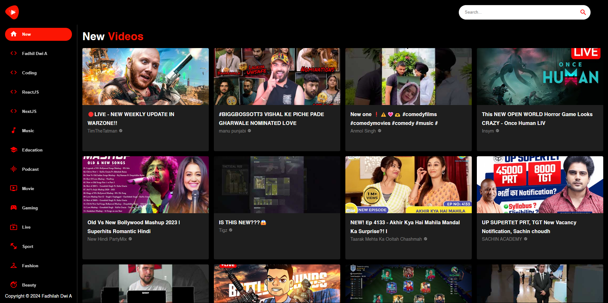
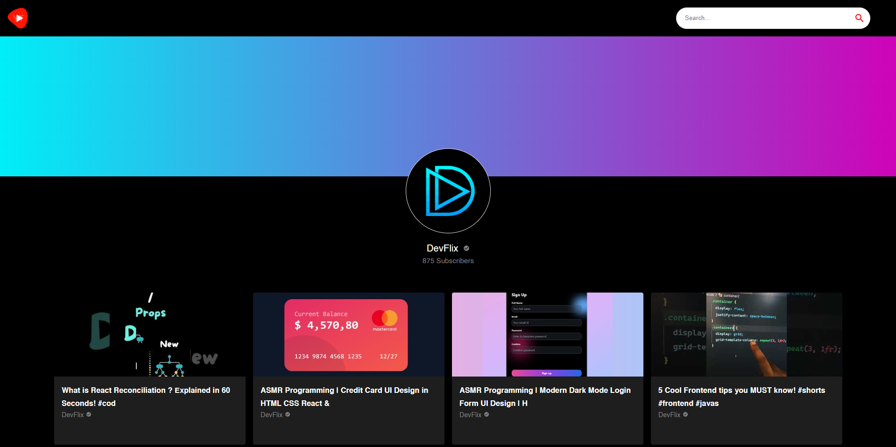
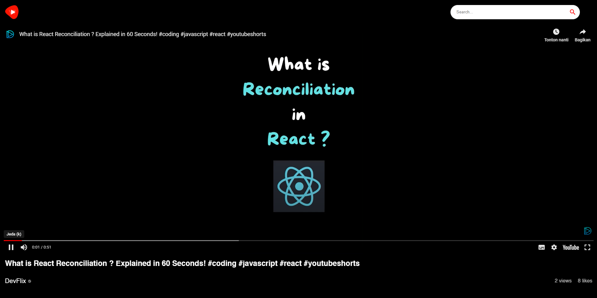

<h1 align="center">Youtube Clone</h1>

This project is an example of using `Vite + React + TS`, `Material UI`, `React Query`, and `Rapid API`.

---

<br>

### Home, Search, Channel Detail, and Video Detail Page

<h1 align="center">
  
  
  <!-- 
   -->
</h1>

## 📱 Features

- Create layout using components from Material UI
- Integration of Youtube V3 API from Rapid API
- Create hooks for fetching data using React Query

## 🚀 Technologies & Resources

- [x] [React + Vite + TypeScript](https://vitejs.dev/)
- [x] [Material UI](https://mui.com/material-ui/getting-started/)
- [x] [Axios](https://axios-http.com/docs/intro)
- [x] [React Query](https://tanstack.com/query/v3)
- [x] [Rapid API](https://rapidapi.com/ytdlfree/api/youtube-v31)

## 💻 Installation

1. #### Clone the repository:

   ```bash
   git clone https://github.com/fadhildwia/youtube-clone-react-mui.git
   ```

2. #### Navigate to the project directory:

   ```bash
   cd youtube-clone-react-mui
   ```

3. #### Install the dependencies:
   ```bash
   yarn
   or
   npm install
   ```
4. #### Make a copy of `.env.example` to `.env`:
   ```bash
   # Put your Rapid API credential in .env file
   cp .env.example .env
   VITE_APP_X_RAPIDAPI_HOST=[key]
   VITE_APP_X_RAPIDAPI_KEY=[key]
   ```
5. #### Run the project:
   ```bash
   yarn dev
   or
   npm run dev
   ```

<!-- ## License

This example application is licensed under the [MIT License](LICENSE).

--- -->

---

Feel free to explore the code and adapt it to suit your needs! If you encounter any issues or have suggestions for improvements, please don't hesitate to open an issue or submit a pull request.
